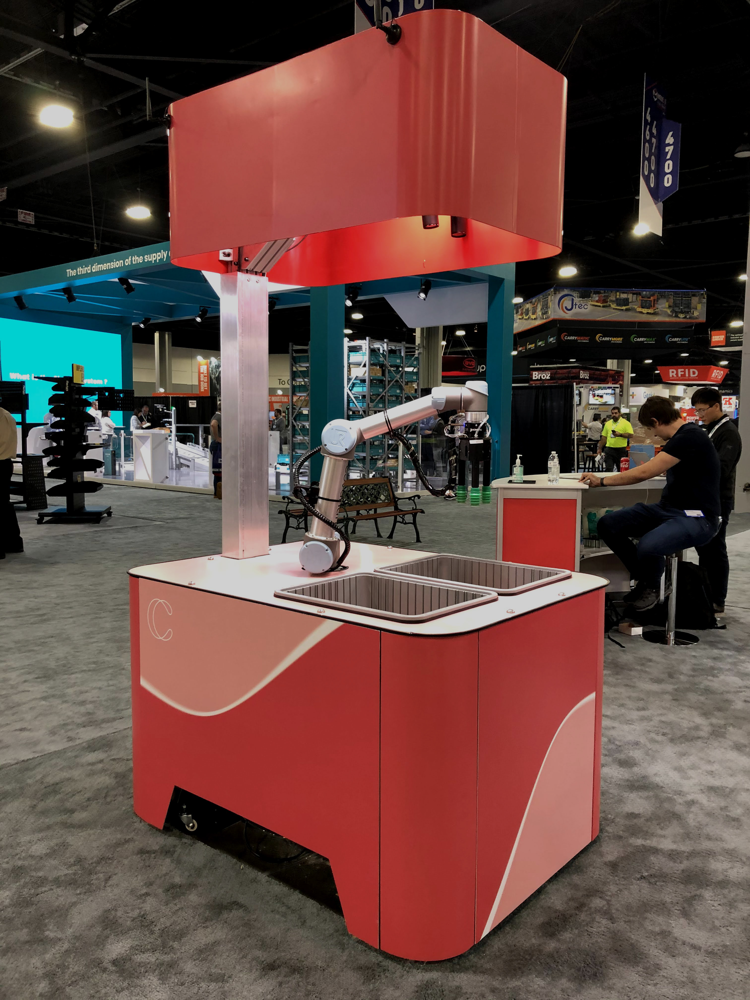
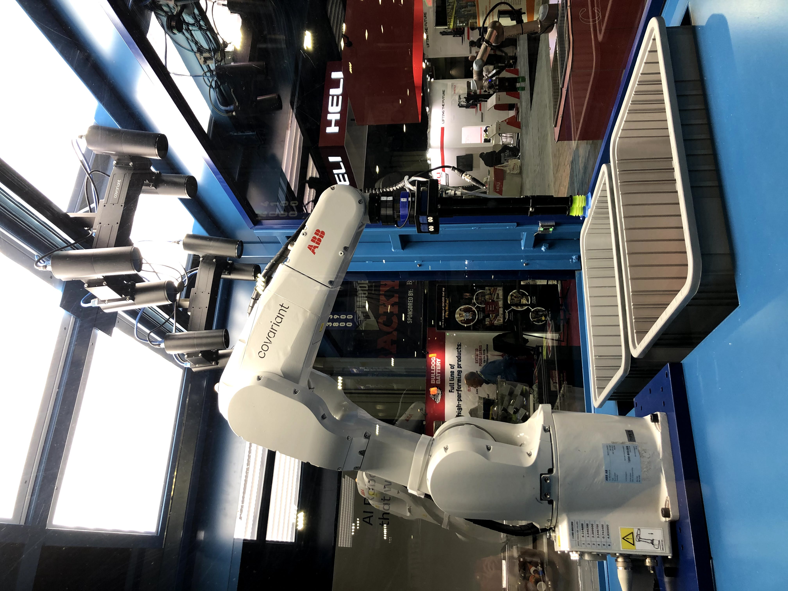

Covariant is an AI robotics startup that was spun out of deep learning research lab at UC 
Berkeley; I work on the hardware team there assisting development of novel robotic end effectors and 
managing the in-house testing stations and camera equipment.

I also helped develop the collaborative and industrial stations pictured below that 
were sent to Atlanta for Modex 2020, a manufacturing and supply chain tradeshow.

