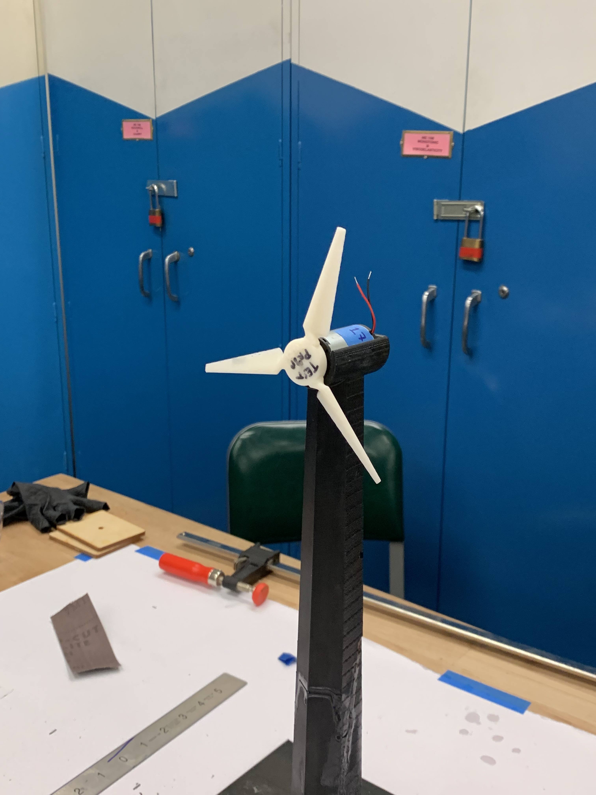

For this project, I was tasked with designing and 3D-printing the tower for a wind turbine 
assembly. I optimized for stiffness and weight, working under constraints for total build volume,
build area, and a minimum number of individual parts (2).

I looked at existing designs for inspiration, and was struck by the urge to design an elegant, 
skeletal tower that was moderately stiff but incredibly light. I then looked at the grading rubric 
for this project, which emphasized stiffness over weight. Given a hard cap on total build volume, I 
decided to pursue dense, solid designs that minimized support volume.

I initially modeled a simple cylindrical tower in Solidworks, and then ran static FEA's to 
determine maximum displacement under a 10 N load. Deflection was quite high, around 3 mm.

I then tried adding gussets radially around the cylinder , which seemed to help significantly in FEA's.

In speaking with some MechE alumni, I learned that Solidworks was relatively inaccurate at predicting the behavior of 
plastics, especially with potentially large deflection. So I decided to move on to prototyping
with PLA.

Since my tower had to be printed in two pieces, I came up with a simple puzzle-piece 
inspired interface between the top and bottom.

Unfortunately this interface was the weakest part of the first print, and splintered immediately 
in testing. I sat down and spent some time thinking about why it was such a weak design.

I iterated through many more designs, learning a little more each time I split the tower into bodies 
and loaded them into Cura. I decided to increase the size (depth) of the interface so that forces would be 
translated over greater surface area within the joint. I eliminated overhang to cut down on support material,
which counted towards our total build volume. And I flattened the ends of the split surface to eliminate impossible-to-print 
edge cases on the sides of the interface.

The interface printed beautifully on my first attempt and I stuck with it.

After two successful prototypes, I spoke with Chris Parsell in the advanced fabrication lab 
about properly printing my model in ABS on the Dimension 1200es printers. He strongly recommended 
orienting the two halves horizontally so that the layers of ABS would be oriented perpendicular, (instead 
of parallel to) any applied force, thus minimizing deflection.

Unfortunately, my gusseted design necessitated huge amounts of support material when oriented 
horizontally, putting me way over the build volume limit. So I went back to Solidworks and experimented 
with oblong and triangular cross-sections, eventually settling on a hexagonal shape that offered 
nearly the same transverse stiffness as the gusseted cylinder with none of the support material.

After prototyping with different infill patterns and densities in PLA (the black and green prototypes to the right), 
I put the model through CatalystEX and queued it on the Dimension printer.

