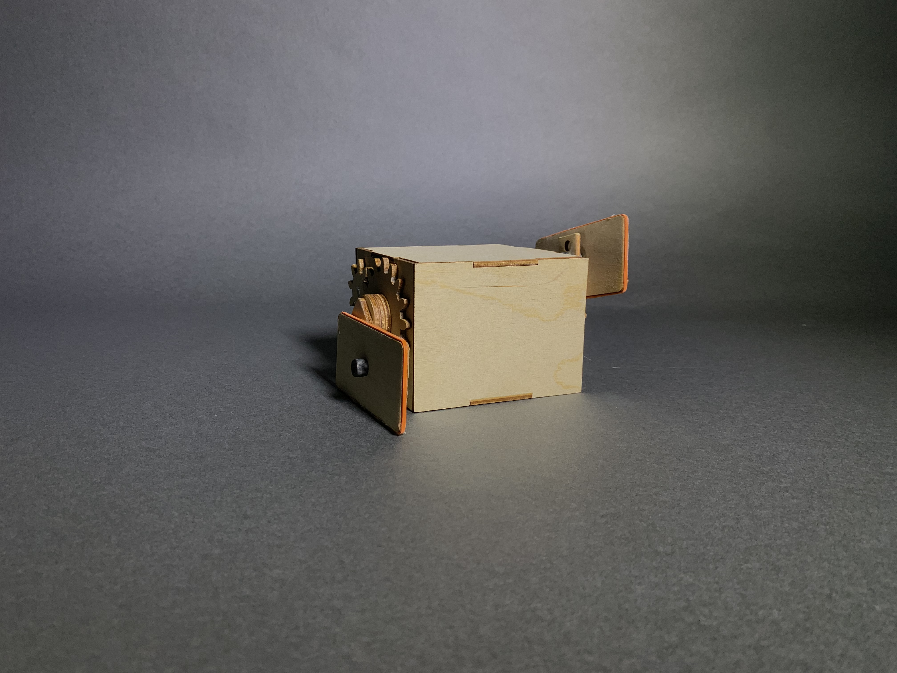
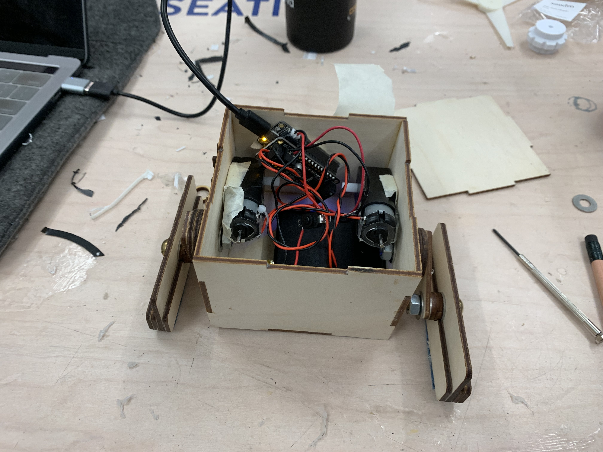
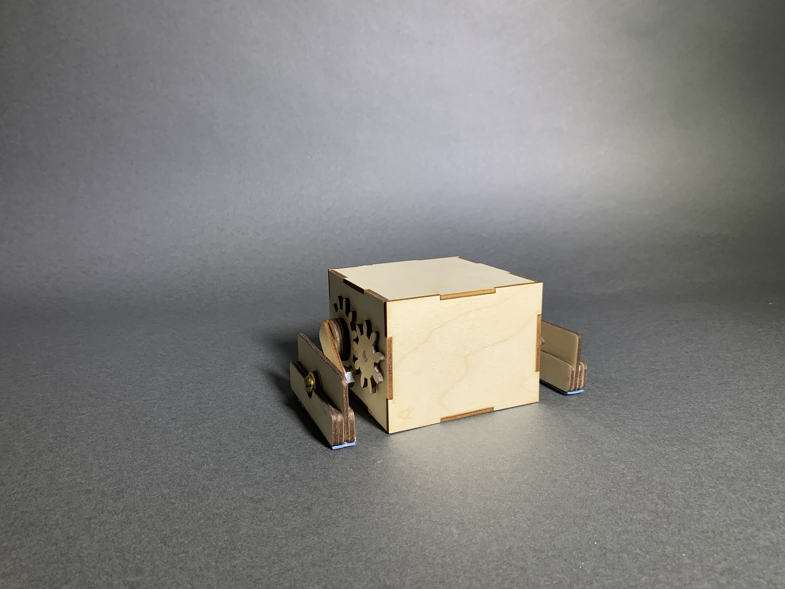
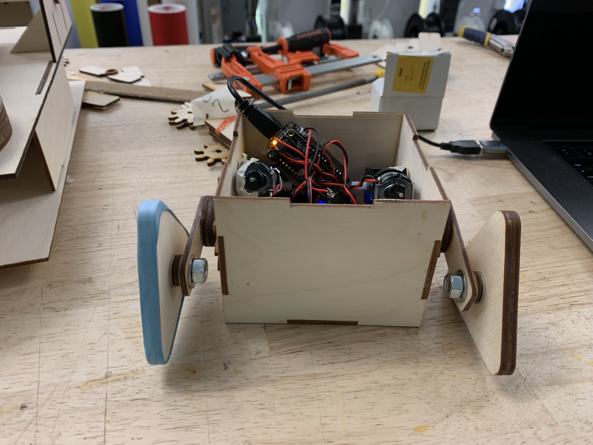
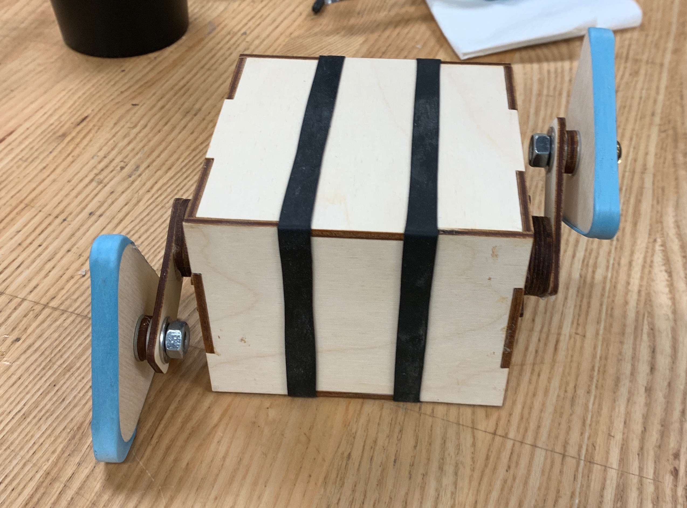

This goal of this project was to design a vehicle capable of tackling an obstacle course comprised of 
ramps and speed bumps with one caveat: no wheels allowed. Looking at past projects, it seemed that there 
were a couple archetypal designs that got copied every year, namely tank-like treaded vehicles and normal-
looking cars with wooden spirals or spokes instead of wheels. With this in mind, my partner 
<a href="http://www.sonadolasia.com/index.html" target="_blank">Sona Dolasia</a> and I 
decided to pursue a "stomping" type vehicle, which moves as the name would suggest.

For our first iteration, I designed an incredibly simple motive mechanism with a set of two gears. 
I used what hardware we found lying around to connect the gears to our box. We were both surprised at how well the 
first prototype moved and turned.

<video width="600" controls>
  <source src="media/stomper/StomperV1.mp4" type="video/mp4">
  
Your browser doesn't support HTML5 video. Here is
     a <a href="https://youtu.be/Z09ctN7BRMc">link to the video</a> instead.

</video>

With V1 in the bag, we then focused on reducing friction inside the motive mechanism, and increasing 
the durability of the vehicle as a whole. We sourced metal washers to isolate rotation of the gears from the 
box, and also align the gears perfectly with respect to the sides of the box. I sanded down irregularities on 
the sides of the DC motors so they mounted flush against the sides of the box. We applied thread locker to all 
the bolts to prevent them from tightening or loosening if they happened to rotate with the gears.

And, in order to help the rectangular feet re-orient between stomps, we added mass to the bottom of both feet 
in the form of additional layers of wood. Sona also added some thicker rubber bands to the bottoms in an 
effort to gain more traction.

Unfortunately, our second version still had trouble getting proper traction, and the rectangular feet 
occasionally wouldn't re-orient while in the air between stomps.

<video width="600" controls>
  <source src="media/stomper/StomperV2.mp4" type="video/mp4">
  
Your browser doesn't support HTML5 video. Here is
     a <a href="https://youtu.be/Z09ctN7BRMc">link to the video</a> instead.

</video>

For our third and final version, we decided to switch to a triangular shape for the feet, and 
stretch rubber bands around them. We also relocated the battery pack to the front of the vehicle (to 
prevent tipping while climbing) and switched to lighter non-rechargeable batteries.

We also added rubber bands to the entire circumference of the box as another slight traction aid 
for climbs.

Our final design is set to be tested at the Jacobs Hall Design Showcase on December 11.

