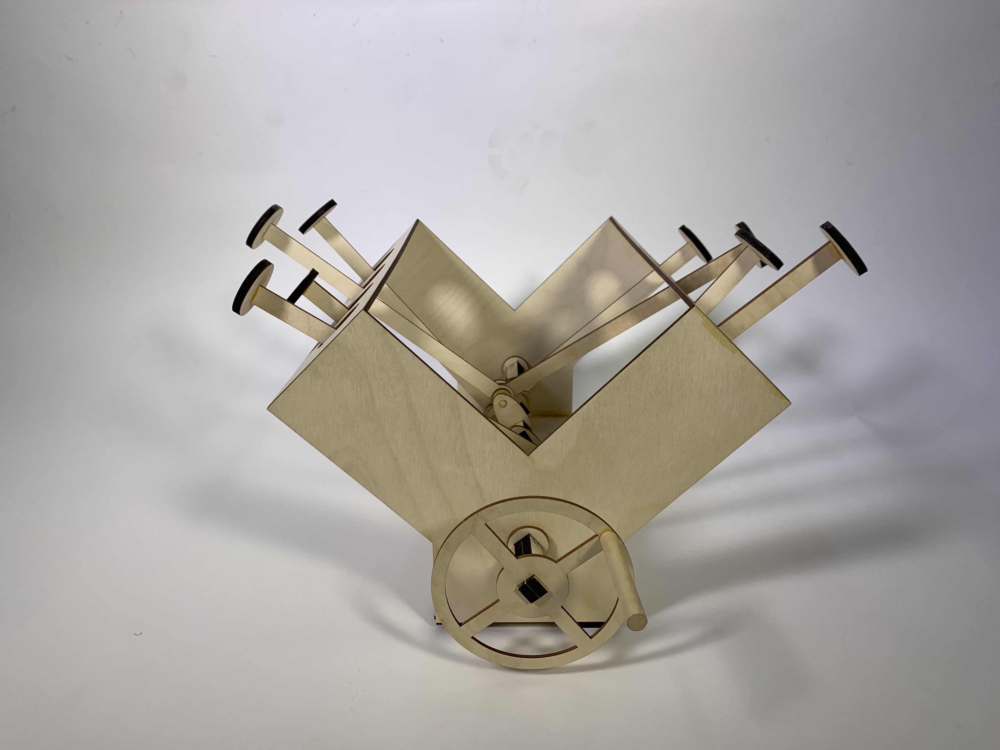

This goal of this project was to design a vehicle capable of tackling an obstacle course comprised of 
ramps and speed bumps with one caveat: no wheels allowed. Looking at past projects, it seemed that there 
were a couple archetypal designs that got copied every year, namely tank-like treaded vehicles and normal-
looking cars with wooden spirals or spokes instead of wheels. With this in mind, my partner––Sona Dolasia––and I 
decided to pursue a "stomping" type vehicle.

<video width="600" controls>
  <source src="media/proj-4/StomperV1.mp4" type="video/mp4">
  
Your browser doesn't support HTML5 video. Here is
     a <a href="https://youtu.be/Z09ctN7BRMc">link to the video</a> instead.

</video>

