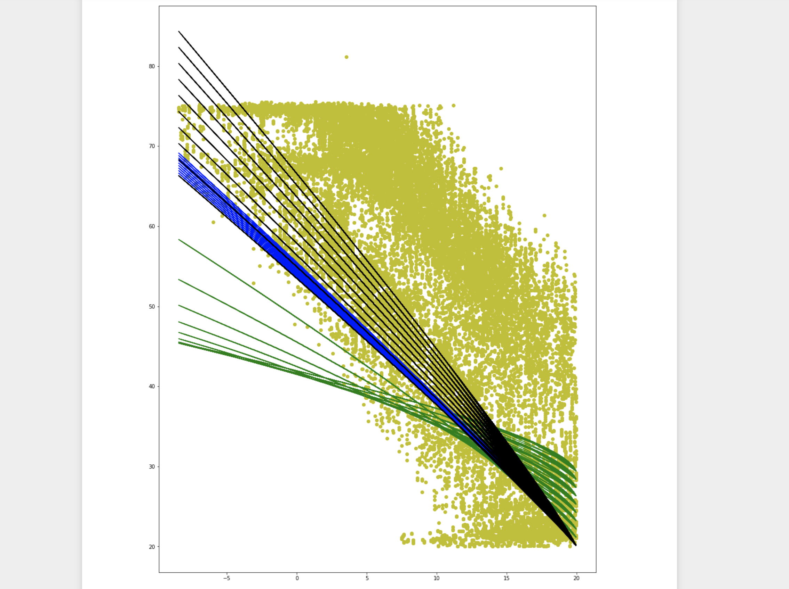

I was lucky enough to spend the summer of 2019 as a product development intern at KUGU Home in 
Berlin, Germany. KUGU offers a simplified utility billing platform for apartment building 
managers and landlords.

During my time at the company, I helped develop an analysis and visualization tool for 
their next-generation energy efficiency product. I pulled temperature data from a 
timeseries database, wrote a Python script to run the data sets through multiple different regressions, 
and then used Jinja templating to display graphs and relevant statistical relationships. 
I also implemented a Python script to publish MQTT messages directly to a timeseres database to improve 
pipeline efficiency.

Here is an example visualization of how different variables affect a water heater 
efficiency model:

A huge thank you is in order to the incredible group of people I worked with last summer. I 
learned so much just by being in proximity to real product designers and software developers.