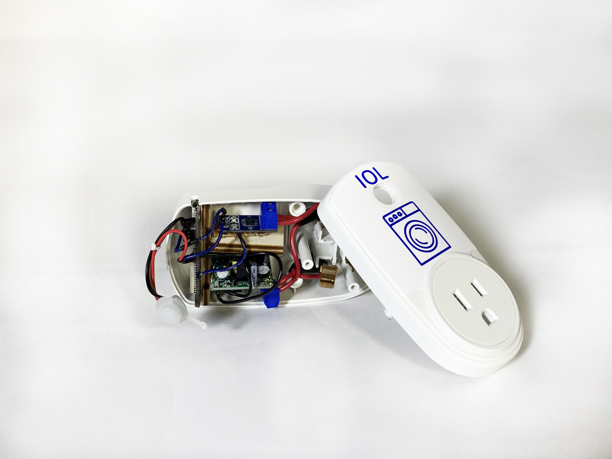

For this mini IoT group project, we asked ourselves how we could implement "smart" functionality 
into our everyday lives as simply and unobtrusively as possible. The result was Internet of Laundry: IoL.

IoL is a smart plug for communal laundry machines. It detects current flow and updates a website 
with machine status, and allows users to receive an email notification when a machine becomes free.

We cleaned out the inside of a commercial smart plug housing, and crammed an ESP32 microcontroller, current 
sensor, and RGB LED, all powered  with an AC-DC 5V step-down.

We used AWS to host a Mosquitto MQTT broker, mySQL database, and Apache web server, and run Python 
scripts that moved data between the three. Javascript running on the client browser asynchronously 
pulls data from the database, and updates amperage readouts and animations on the web page.

A huge thank you is in order to Philipp Kurz, an incredibly talented mechatronics major from 
the University of Applied Sciences, Stuttgart, and my partner for this project.