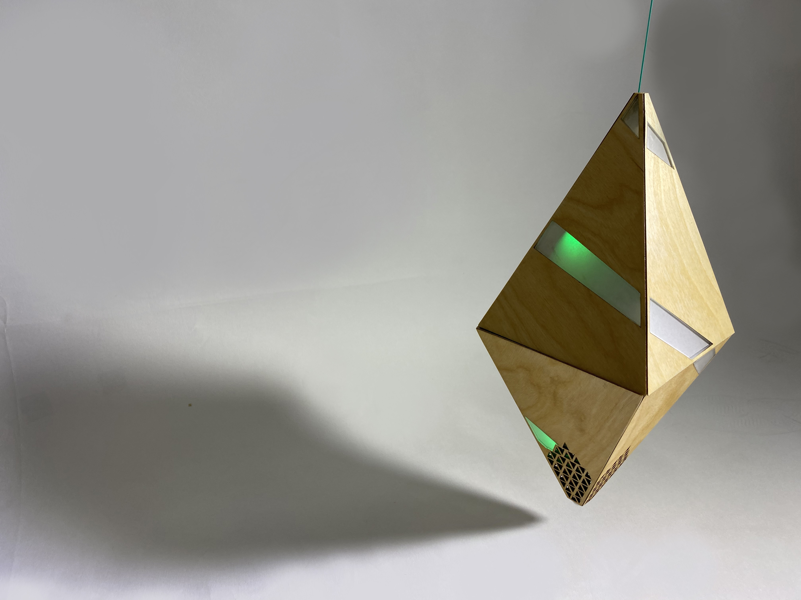
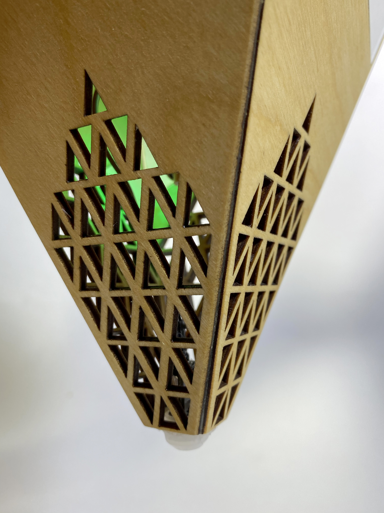
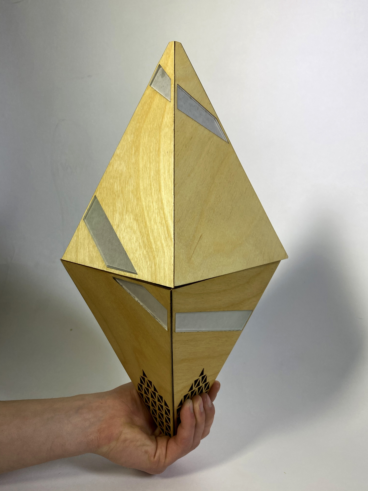
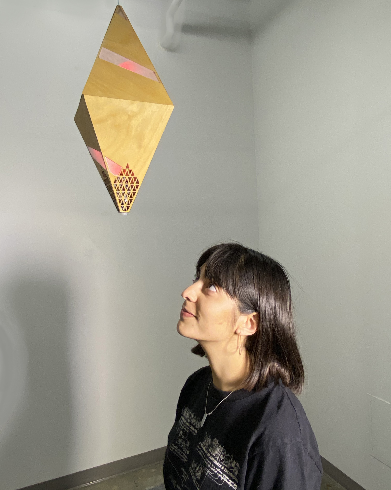
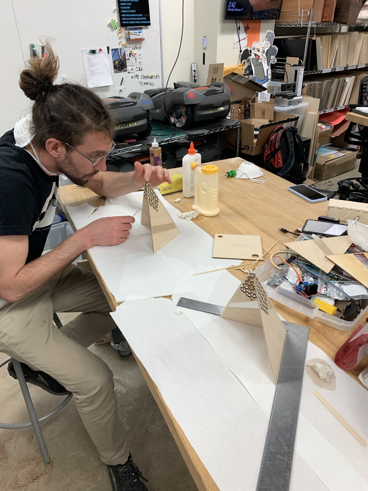
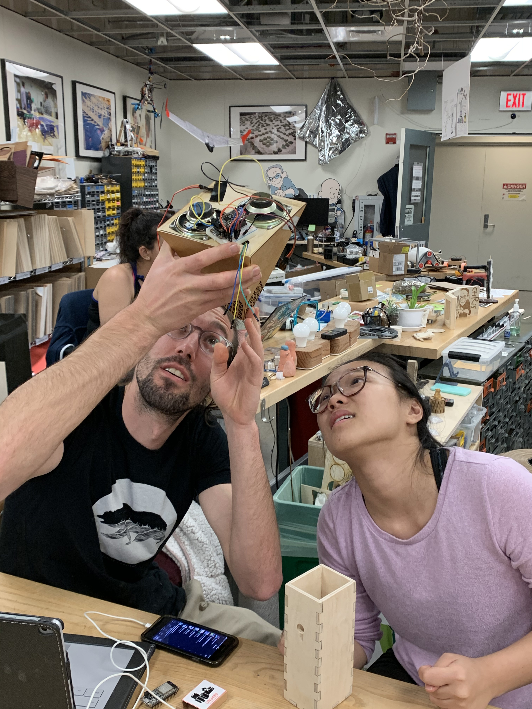
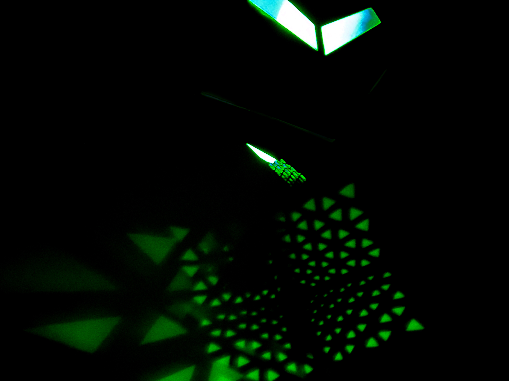
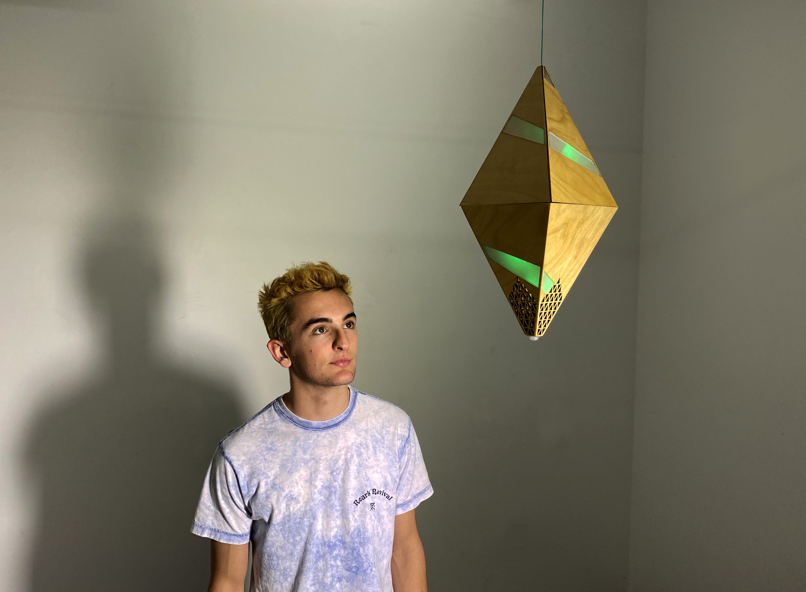

Sentry is an interactive speaker designed to nudge people out of their daily routine by
 bluntly presenting the ubiquitous and implicit social pressures around them.
 

It invades personal space by hanging at head level, uses a motion sensor to detect when people walk 
nearby, flashes LED strips to get attention, speaks authoritatively with dual integrated 
speakers, and retracts up and out of sight with a hidden winch system.

Implemented on the UC Berkeley campus, Sentry underscores our implicit submission to 
capitalist values–specifically those having to do with the technology industry of the 
Bay Area–by encouraging students to derive self-worth solely from their success in the tech scene.

Sentry was created with the help of Tiffany Tao and Felix de Rosen, my partners for the 
first provocation of the spring 2020 Critical Making class at UC Berkeley.

Sentry was built over the course of a week. The enclosure was cut from stained birch with 
frosted acrylic inserts. Internal electronics include two WS2812b LED strips, a PIR motion 
sensor, two 1W speakers, and a high-torque pulley modified to be continuous rotation,
all driven by a Feather 32u4 Bluefruit LE and LiPo battery.

