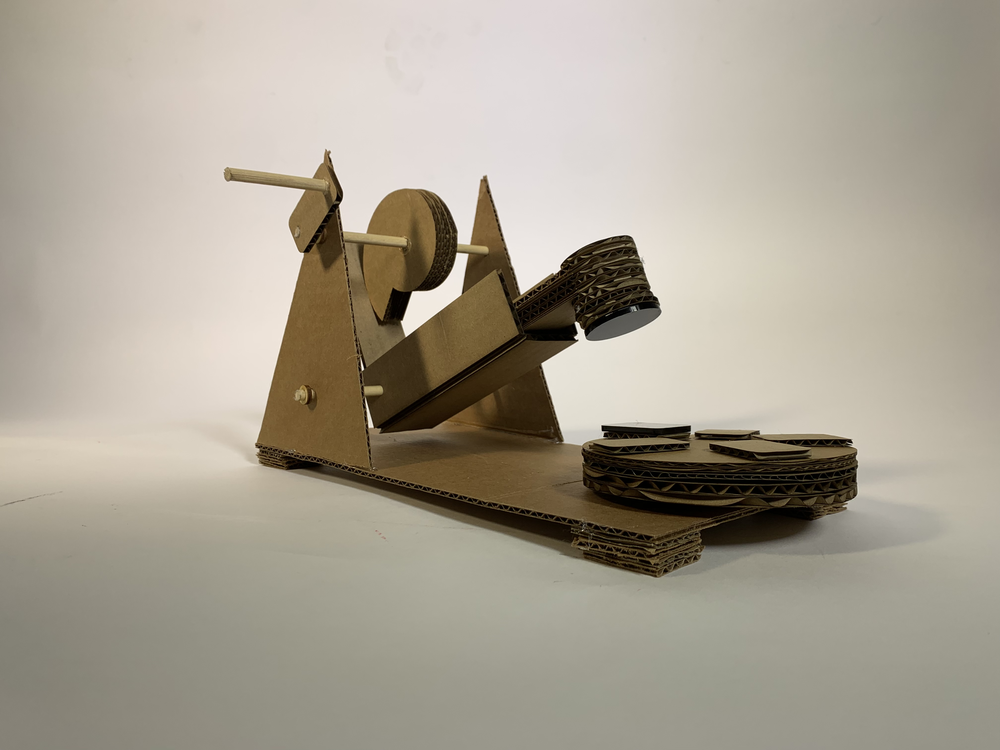
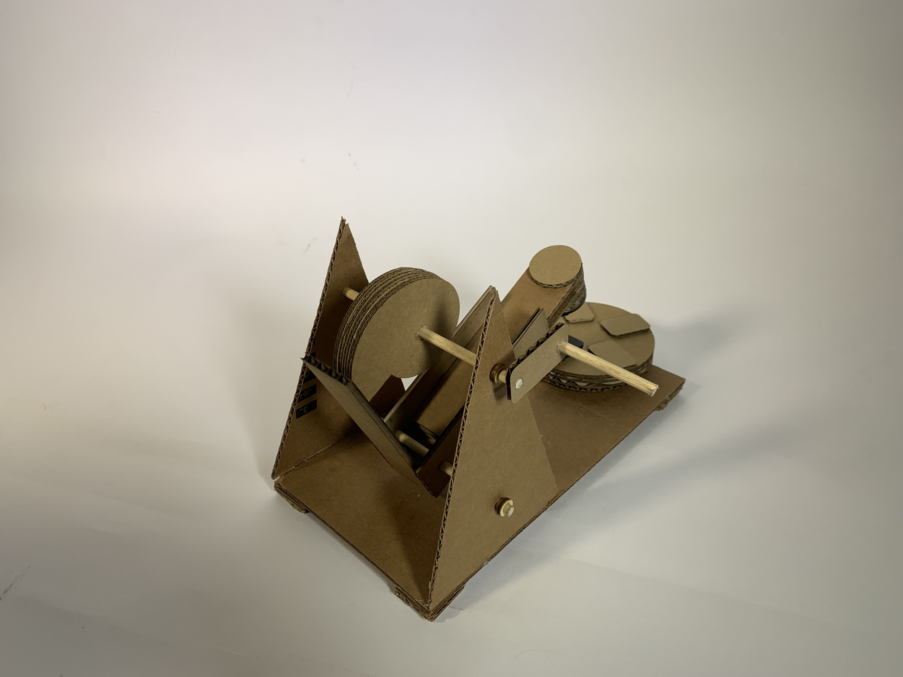
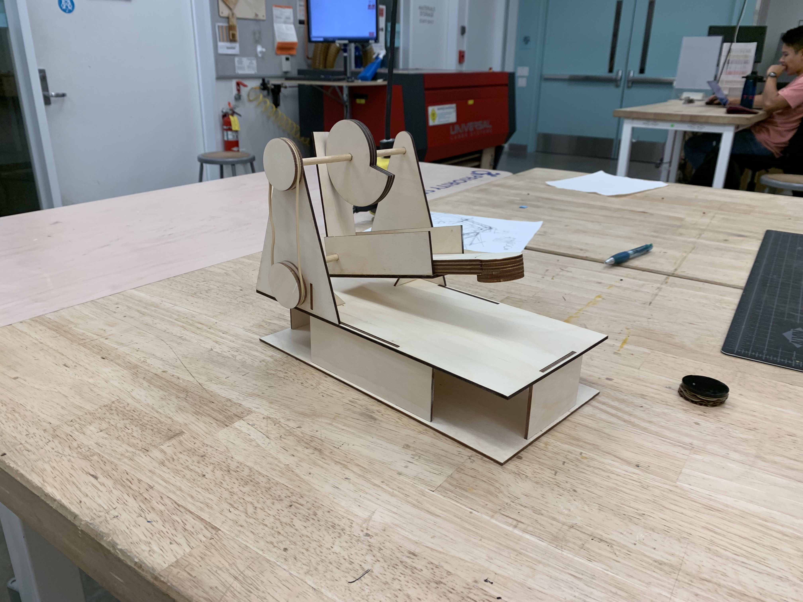
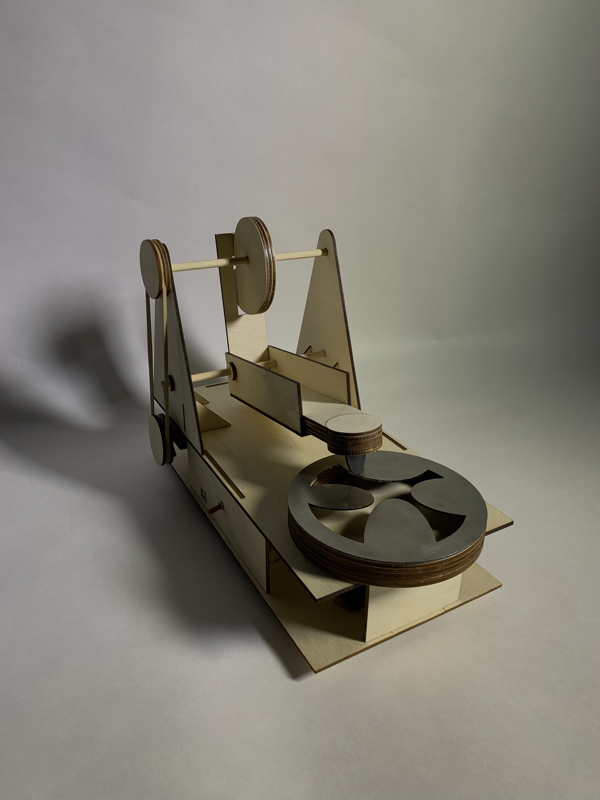
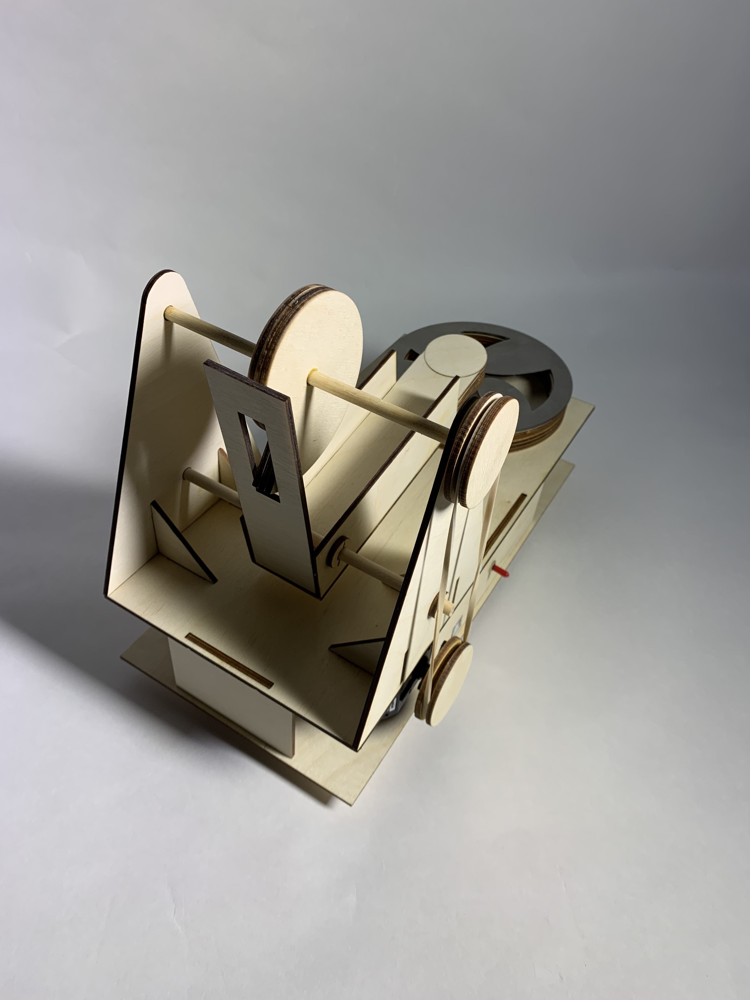
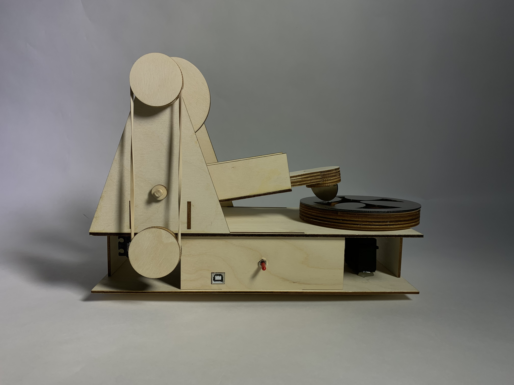
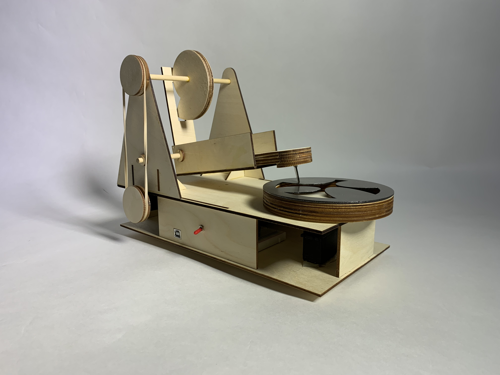

This challenge for this multi-week fabrication project was to design an analogue sound-generating 
mechanism. Drawing on inspiration from class, my partner and I decided to pursue a Davinci 
cam hammer design.

Our proof-of-concept was a simple cardbord model with an acrylic striker and rotating "sound board."

We then laser cut the design, raising the platform so that our Arduino, batteries, breadboard, 
and servos could fit underneath.

The rubber band pulley worked perfectly so we stuck with it. We then laser cut a metal disk 
with uniquely shaped "tongues" protruding into the center, the idea being that the tongues 
would produce different notes when struck.

We also cut a metal striker for the hammer, and cut a slot in the back of the hammer sled so 
that the hammer could fall more quickly.

Finally, we added a switch to easily power on the servos, and wooden washers to keep the striker 
sled centered.

