For this project, I was responsible for designing the cooling system for the Berkeley Formula Racing 2020 car (B20).
I was challenged with selecting an appropriate radiator and designing and manufacturing mounting, ducting, and plumbing.

One of the biggest design changes for the 2020 car was our updated engine package, a KTM 450SXF. 
With an extra 100cc of displacement and up to 20 more horsepower, I needed to meet a higher 
significantly heat rejection rate than was achieved on B19.

Quantifying increased heat production in the 450 proved to be a challenge; basic heat convection 
calculations pointed to a frontal surface area increase requirement of about 12%. Simple scaling calcs 
(B20 horspower / B19 horsepower) pointed to an increase of 9%. After reading some literature from 
other formula teams, I decided to go with a Mishimoto ATV radiator that had a frontal area increase of 
roughly 10% over B19, with most other factors (number of coolant passes, fin density) kept the same.

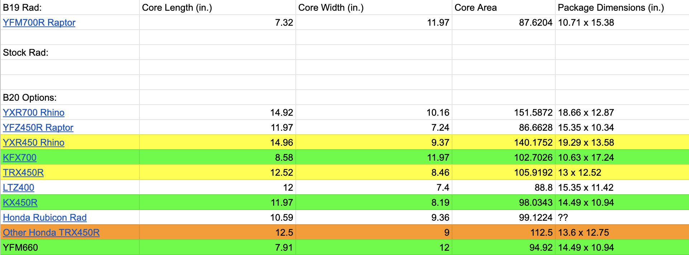

With a radiator selected and a rough model inserted into Solidworks, I set about designing a 
mounting system. I kept my first iterations roughly similar to B19, with easily manufacturable  
aluminum tabs that bolted to corresponding steel tabs on the chassis. In order to (1) ensure compliance and (2) 
compare stiffness to B19, I ran static FEA's under worst-case loads: 1.5G acceleration, 2G cornering, and 3G bumps.

<h4>2019 Displacement:</h4>
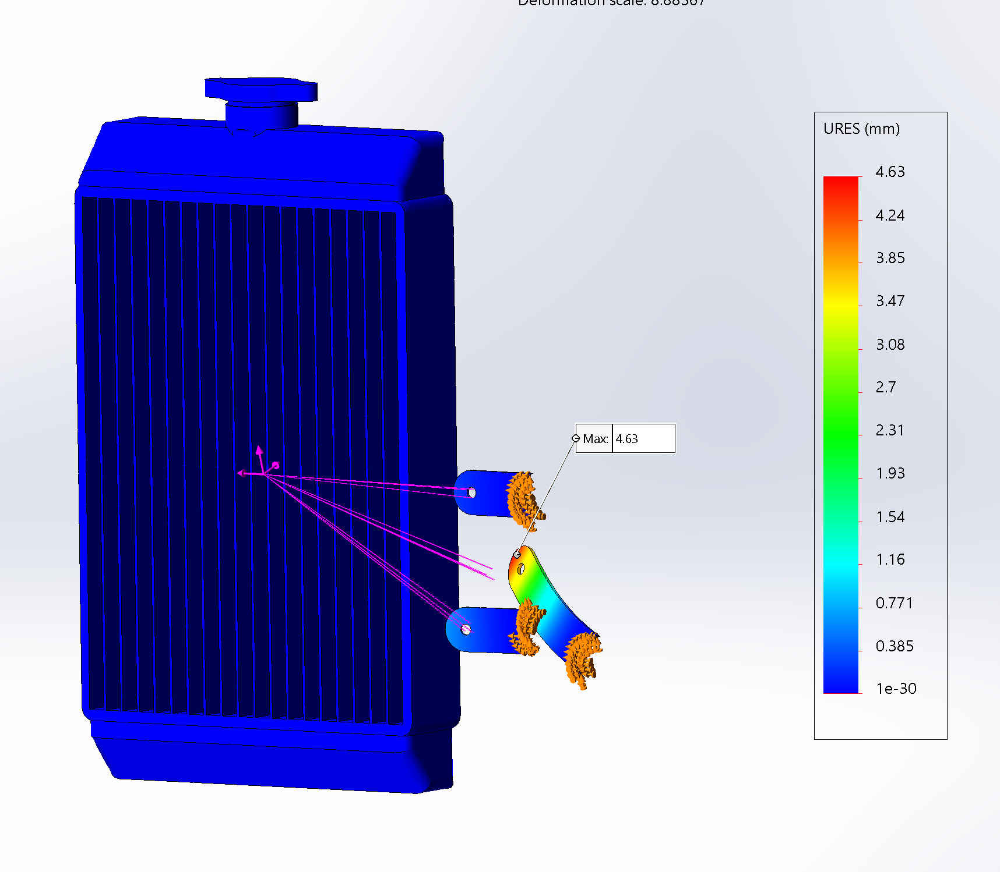
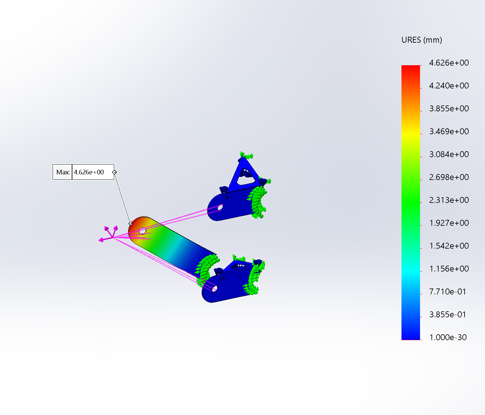

I initially planned to go with three sets of tabs, two on the chassis, and one on the far side 
of the radiator connected to the sidewing. Our aero team, however,  decided not to run sidewings for 
the 2020 car, so I came up with a new design using a rod to connect the outside edge of the radiator from 
deflecting. FEA's showed significant improvement, less than a millimeter of deflection.

<h4>2020 Displacement:</h4>

My initial design relied on a solid tube welded to the bottom edge of the radiator. After 
consulting with my team lead, we decided to move the rod to the top of the radiator (allowing the 
radiator to be lowered as much as possible) and swap it out for a more aesthetically pleasing, and 
modular, tie rod.

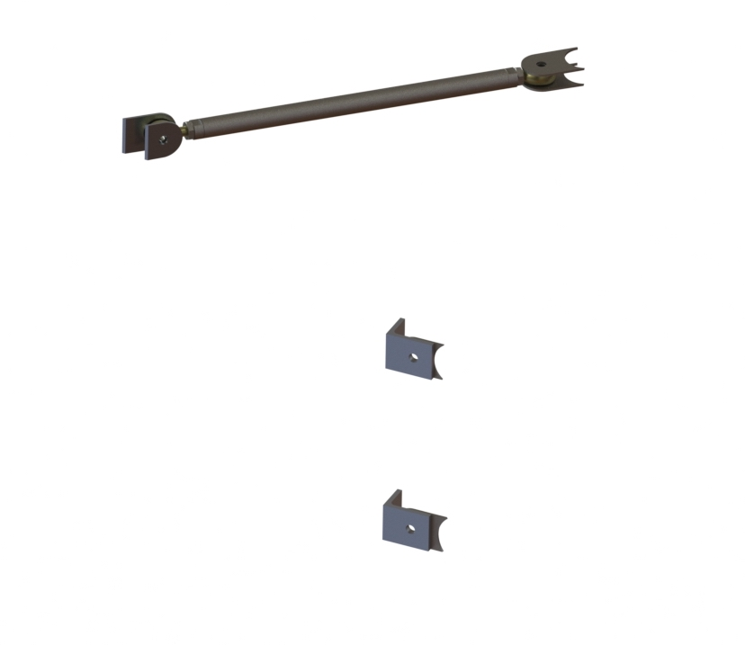

Finally, I designed a fan shroud to be molded out of carbon fiber. I intend to consult some alumni as well 
as run some CFD's to validate the necessity of a shroud before manufacturing, as it could be counterproductive 
to always channel air to a fan that isn't always running.

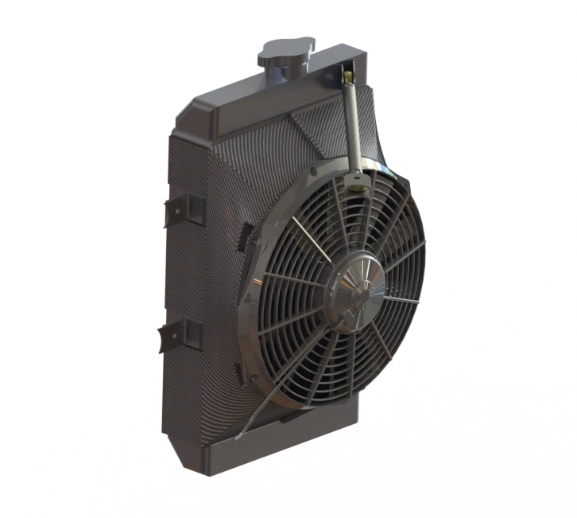

After running through multiple design reviews with formula alumni, the cooling design was finalized 
and I began manufacturing. After acquiring the radiator via a Mishimoto sponsorship, I cut off the 
factory mounting tabs and locator pin.

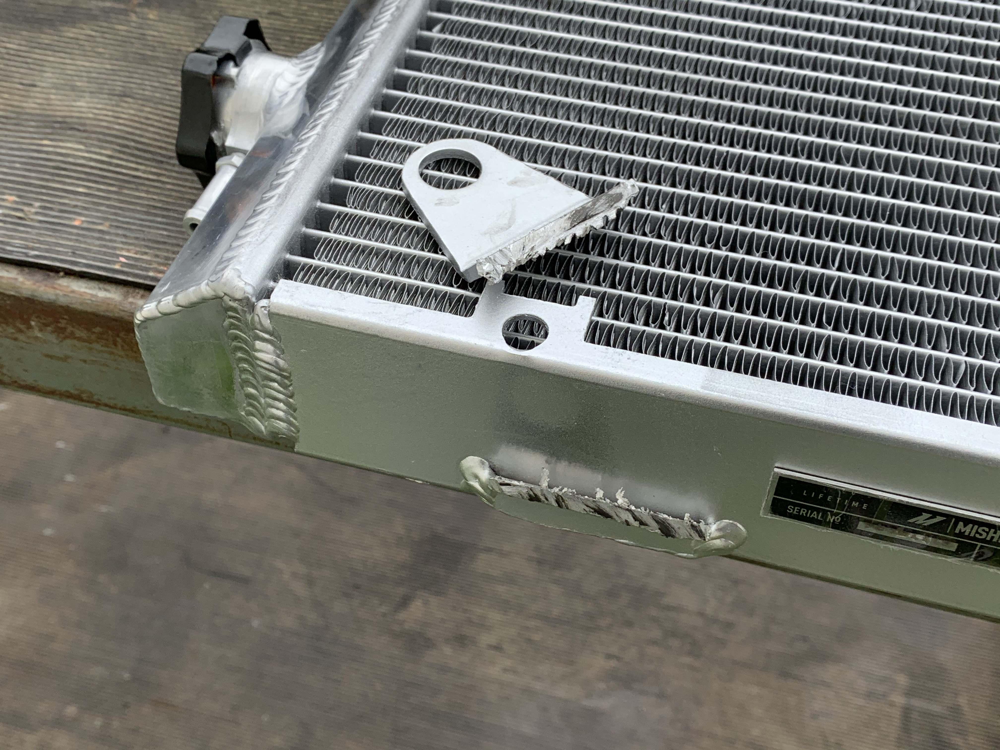

Using the tube profiles I created in Solidworks, I laser cut steel tabs for the chassis, ground 
down the edges, and welded them on. 

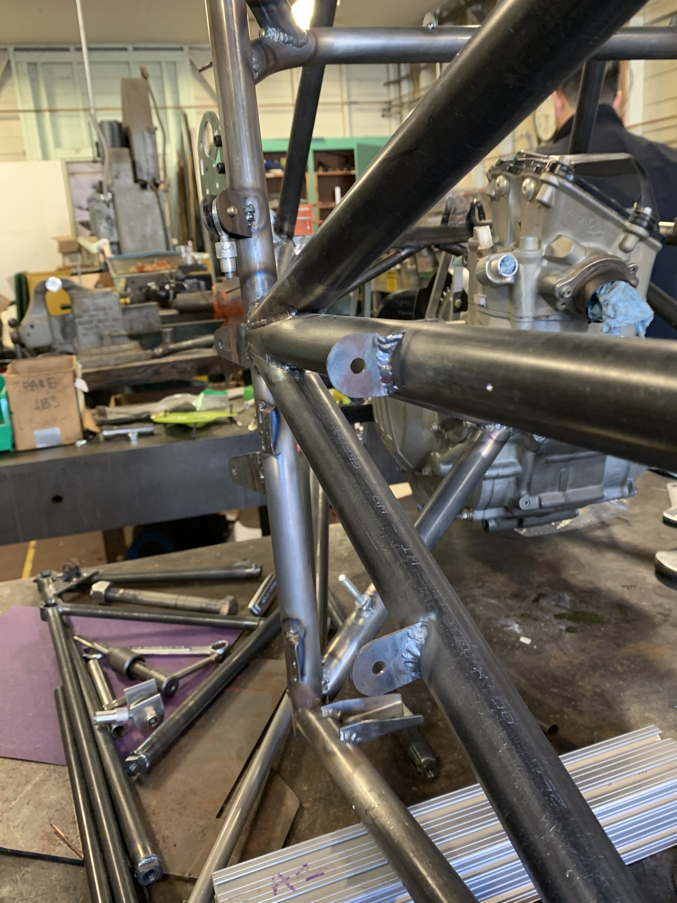

I then cut two new tabs out of 60 thou aluminum for the sides of the radiator, bent them in 
a vice,  used the chassis tabs to align them vertically, and tacked them on.

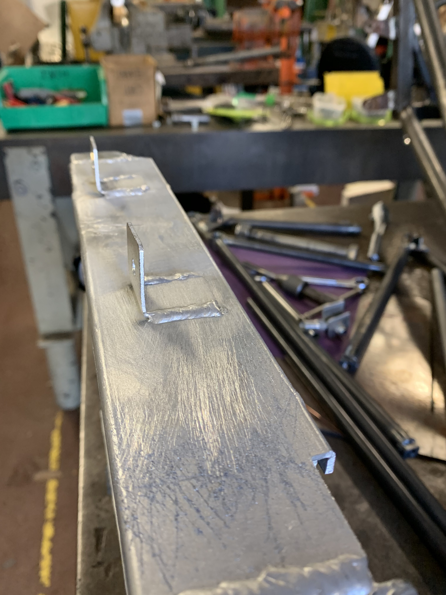

For the rod assembly, the main challenge was machining threaded inserts.
 I first used a lathe to drill and tap through a chunk of solid 0.5" 
aluminum stock, then cut the piece in half with a bandsaw, and cut down 
the diameter so each piece could slide inside 0.5" tube. Lastly, I milled flats onto each 
insert so that the rod could be tightened once on the car.

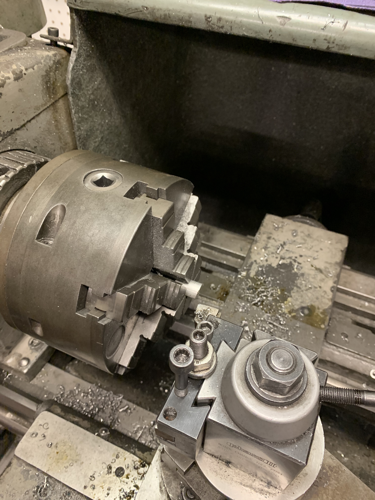

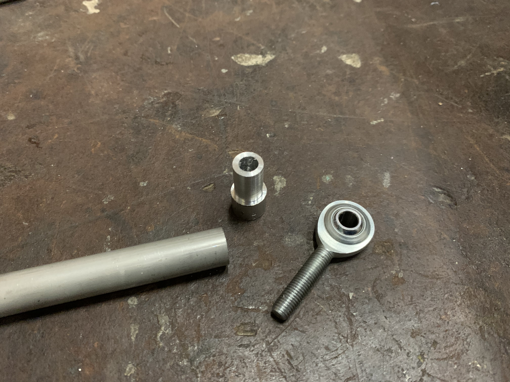

After welding the inserts into the tube, everything was ready to be fit on the newly-painted 
B20 chassis.

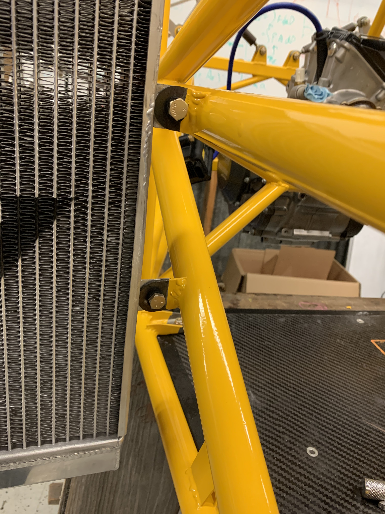

