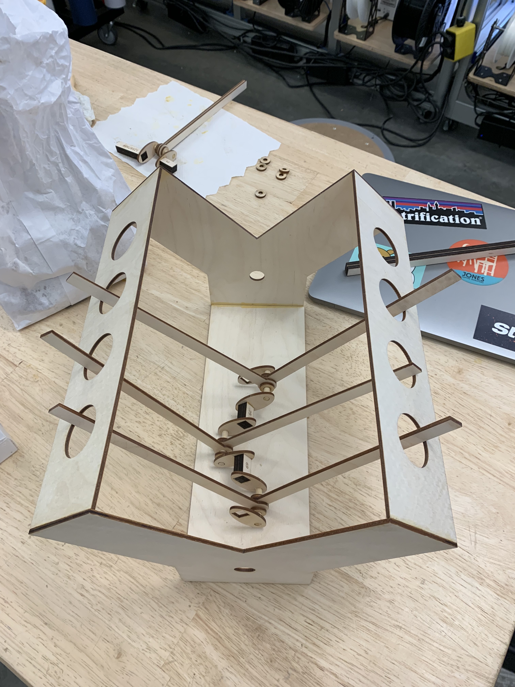
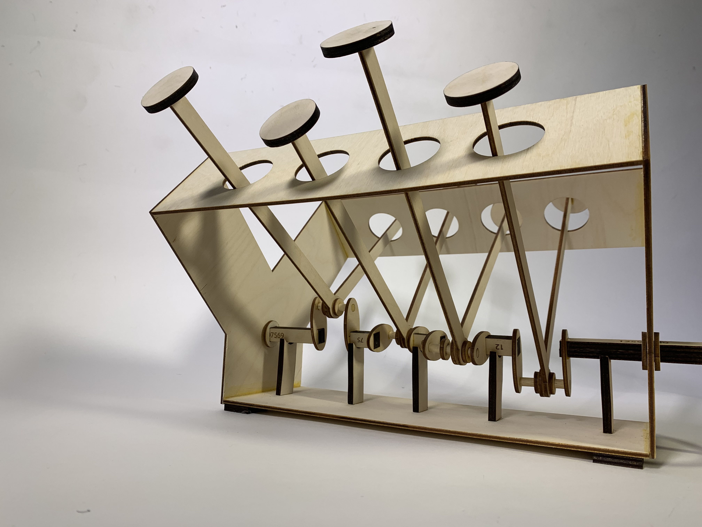

For this two-week project, I was tasked with converting rotary to linear motion, and then 
motorizing my contraption with an Arduino. Being a mechanical engineer and automotive enthusiast 
I decided to replicate the internal motion of a crankshaft and pistons.

After an initial ambition vs. feasibility assessment I decided to pursue a flat four engine: 
a single, straight crankshaft with four evenly-spaced, radially-offset cams to push corresponding connecting rods 
vertically upward.

Upon reviewing alumni projects, I reconsidered my time commitment to the project, and scaled my ambition, aiming for a full crossplane 
V8 engine. I knew from the get-go that the toughest part of modeling any V engine (where two banks of cylinders 
are oriented at a 90° angle) would be the crankshaft.

For this project, I didn't use any CAD software. I designed parts directly in Illustrator and validated them with the laser cutter. 
This was certainly risky, but I think the correct approach for a project such as this with 
so many tiny component interactions that never scale as expected.

I decided to pursue a square-shaped crank in order to eliminate any slip. I cut and sanded uniform 
segments of 1/8" wooden dowels to act as my rod bearing journals, around which the connecting rods 
rotated. These alternated with more square segments, my main bearing journals.

This crank is in a cross-plane configuration, meaning that a cylinder "fires" every 90° the crank 
is rotated. My model has the same firing order (the order in which the cylinders fire) as a Chevy small block V8.

<video width="600" controls>
  <source src="media/v8/rotation.mp4" type="video/mp4">
  
Your browser doesn't support HTML5 video. Here is
     a <a href="https://youtu.be/Z09ctN7BRMc">link to the video</a> instead.

</video>

